# 
<strong> Laporan Praktikum Web Lanjut 

# 
 Jobsheet 2 </strong>

## 
<strong>NIM : 2241720107  

## 
<strong>Nama : Denny Malik Ibrahim  

## 
<strong>Kelas : TI-2H

 
 

## Basic Routing 

Membuat route hello world  
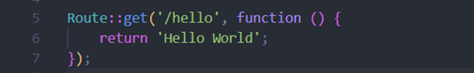
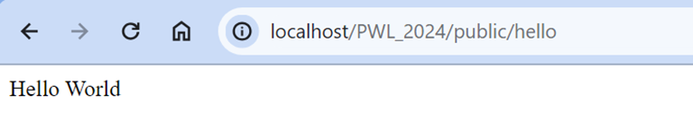

Membuat route world  

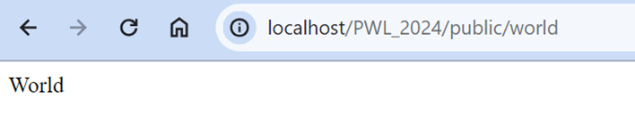

Membuat route selamat datang  
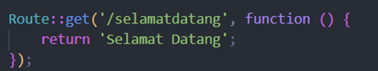
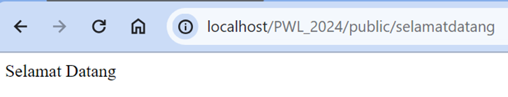

Membuat route about  
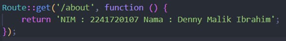
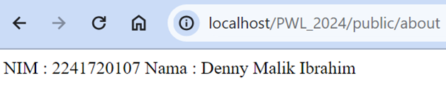

## Route Parameters  

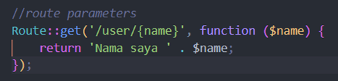
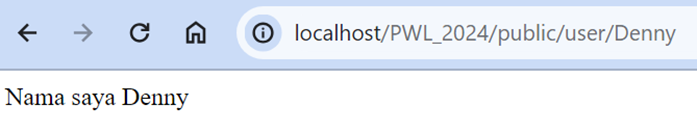

Dengan 2 parameter  
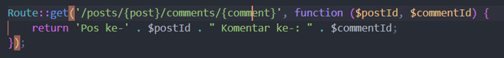
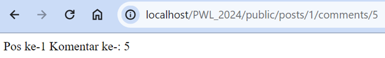  
Suatu route, juga bisa menerima lebih dari 1 parameter

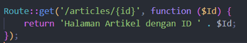

## Optional Parameters  

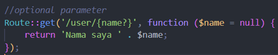
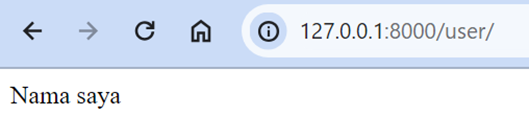  
Parameter boleh tidak diisi karena diinialisasi bisa sama dengan null

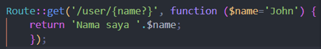
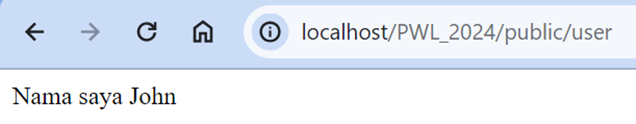  
Muncul nama sesuai parameter yang diinisialisasikan

## Controller  

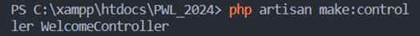
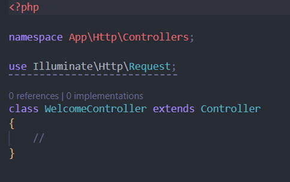

Menambah di route  
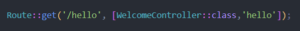
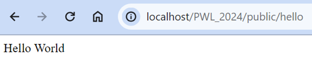  
Setelah sebuah controller telah didefinisikan action, kita dapat menambahkan controller tersebut pada route

## PageController  

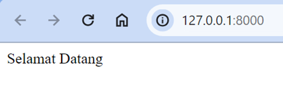
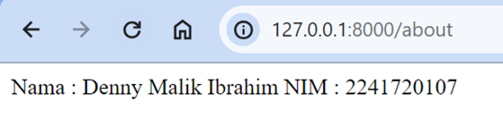
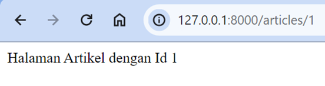  

Memodifikasi kembali implementasi sebelumnya dengan konsep Single Action Controller  

## HomeController  

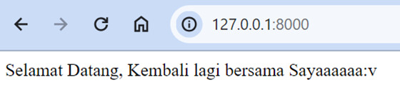

## About controller  

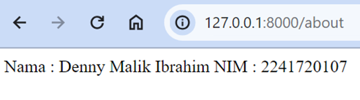

## Articles controller  

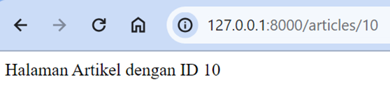

## photoController  

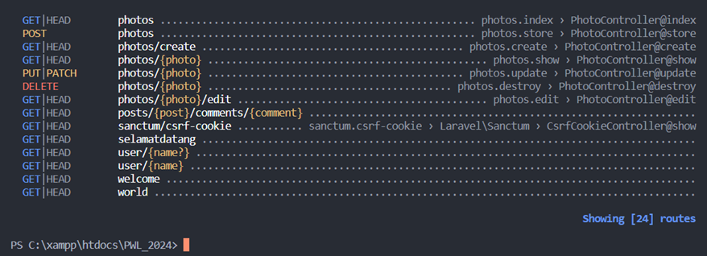

## View  

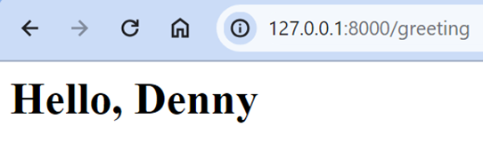  

Melakukan perubahan pada route karena file hello masuk kedalam folder blog  
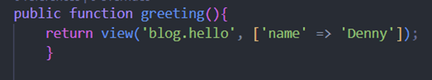
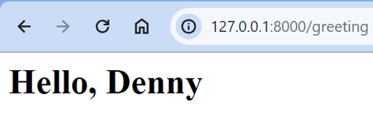  
Hasilnya sama aja  

Mengubah route dan mengarahkan ke WelcomeController  
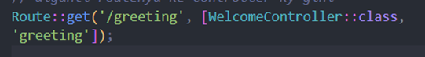
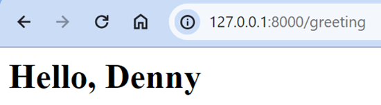
Hasilnya juga sama  

Mengubah fungsi greeting  
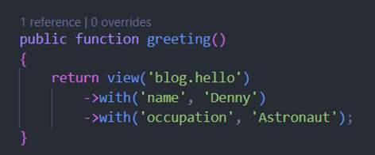

Menampilkan 2 parameter pada hello.blade  
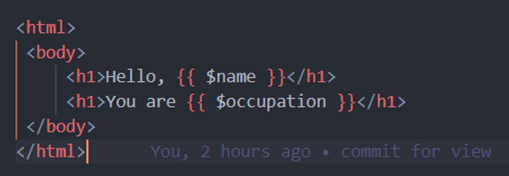
  
Meneruskan array data lengkap ke fungsi view helper menggunakan metode with untuk menambahkan bagian data individual ke view. Metode with mengembalikan instance view objek sehingga kita dapat melanjutkan rangkaian metode sebelum mengembalikan tampilan