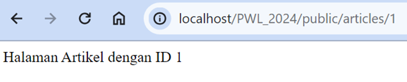

# 
<strong> Laporan Praktikum Web Lanjut 

# 
 Jobsheet 2 </strong>

## 
<strong>NIM : 2241720107  

## 
<strong>Nama : Denny Malik Ibrahim  

## 
<strong>Kelas : TI-2H

 
 

## Basic Routing 

Membuat route hello world  

Membuat route world  

Membuat route selamat datang  

Membuat route about  

## Route Parameters  

Dengan 2 parameter  

  
Suatu route, juga bisa menerima lebih dari 1 parameter

## Optional Parameters  

  
Parameter boleh tidak diisi karena diinialisasi bisa sama dengan null

  
Muncul nama sesuai parameter yang diinisialisasikan

## Controller  

Menambah di route  

  
Setelah sebuah controller telah didefinisikan action, kita dapat menambahkan controller tersebut pada route

## PageController  

  

Memodifikasi kembali implementasi sebelumnya dengan konsep Single Action Controller  

## HomeController  

## About controller  

## Articles controller  

## photoController  

## View  

  

Melakukan perubahan pada route karena file hello masuk kedalam folder blog  

  
Hasilnya sama aja  

Mengubah route dan mengarahkan ke WelcomeController  

Hasilnya juga sama  

Mengubah fungsi greeting  

Menampilkan 2 parameter pada hello.blade  

  
Meneruskan array data lengkap ke fungsi view helper menggunakan metode with untuk menambahkan bagian data individual ke view. Metode with mengembalikan instance view objek sehingga kita dapat melanjutkan rangkaian metode sebelum mengembalikan tampilan