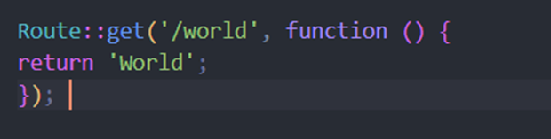
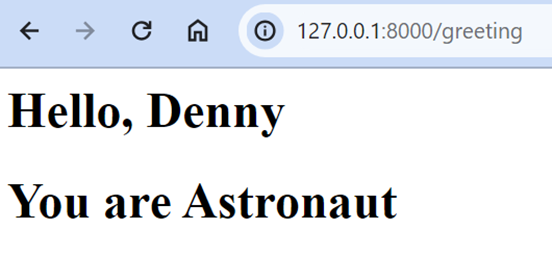

# 
<strong> Laporan Praktikum Web Lanjut 

# 
 Jobsheet 2 </strong>

## 
<strong>NIM : 2241720107  

## 
<strong>Nama : Denny Malik Ibrahim  

## 
<strong>Kelas : TI-2H

 
 

## Basic Routing

Membuat route hello world

Membuat route world

Membuat route selamat datang

Membuat route about

## Route Parameters

Dengan 2 parameter

Suatu route, juga bisa menerima lebih dari 1 parameter

## Optional Parameters

Parameter boleh tidak diisi karena diinialisasi bisa sama dengan null

Muncul nama sesuai parameter yang diinisialisasikan

## Controller

Menambah di route

Setelah sebuah controller telah didefinisikan action, kita dapat menambahkan controller tersebut pada route

## PageController

Memodifikasi kembali implementasi sebelumnya dengan konsep Single Action Controller

## HomeController

## About controller

## Articles controller

## photoController

## View

Melakukan perubahan pada route karena file hello masuk kedalam folder blog

Hasilnya sama aja

Mengubah route dan mengarahkan ke WelcomeController

Hasilnya juga sama

Mengubah fungsi greeting

Menampilkan 2 parameter pada hello.blade

Meneruskan array data lengkap ke fungsi view helper menggunakan metode with untuk menambahkan bagian data individual ke view. Metode with mengembalikan instance view objek sehingga kita dapat melanjutkan rangkaian metode sebelum mengembalikan tampilan